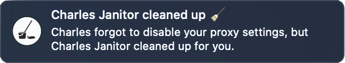

# Charles Janitor

> Cleans up after Charles Proxy.

  
  

Charles Proxy is an extremely lucrative tool that often forgets to [clean up after itself](https://www.charlesproxy.com/documentation/faqs/can-no-longer-browse-without-charles-running/), leaving your proxy settings mangled. `Charles Janitor` is a windowless macOS app that simply turns off web proxy and secure web proxy settings when Charles closes.

## Download 
[Download the latest release](https://github.com/pg8wood/charles-janitor/releases/latest).

## Usage 
Instead of launching Charles directly, launch `Charles Janitor` instead. When Charles closes, `Charles Janitor` will automatically turn off your Wi-Fi proxy settings.
